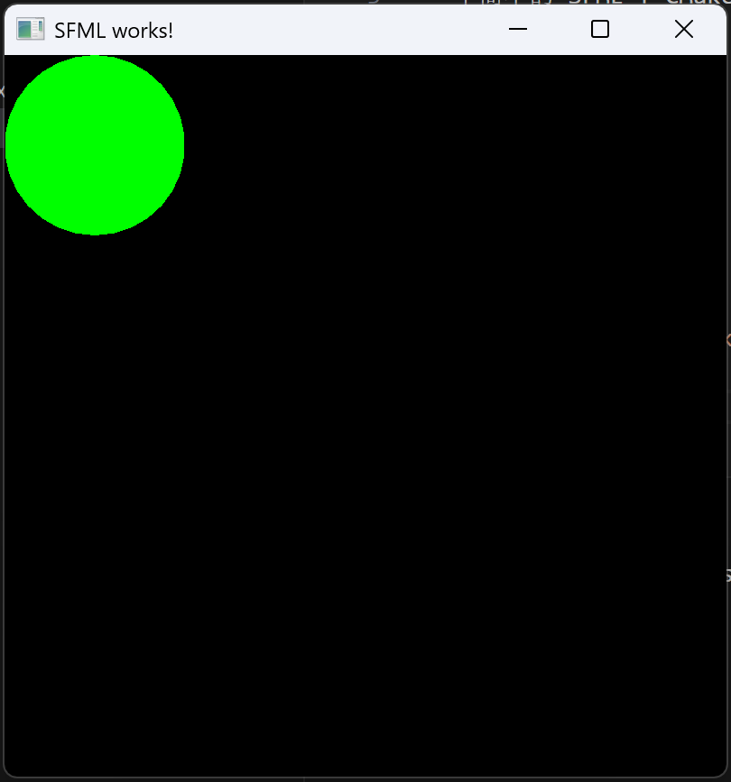

# SFML-Test

一个简单的 SFML + CMake 图形窗口项目，使用 C++17 编写，适合初学者学习图形编程和项目构建。

---

## 🚀 功能特性

- 创建一个图形窗口
- 显示一个绿色圆形
- 使用 CMake 构建系统
- 静态链接 SFML，无需额外 DLL

---

## 🛠️ 构建方法

### 环境要求

- Windows 10/11
- MinGW-w64（GCC 13+）
- CMake 3.10+
- SFML 3.0（静态库）

### 构建步骤

```bash
mkdir build
cd build
cmake .. -G "MinGW Makefiles"
cmake --build .
```



### 技术栈
语言：C++17
图形库：SFML 3.0
构建工具：CMake
IDE：VS Code（可选）

### 注意事项
本项目使用静态链接 SFML，无需额外 DLL
若使用动态链接，请将 SFML DLL 放在可执行文件同目录下
建议使用英文路径，避免 CMake 或编译器异常

### 许可证
本项目为学习用途，暂无许可证，欢迎自由使用、修改和分享。

### 作者
GitHub：@wangxun2008